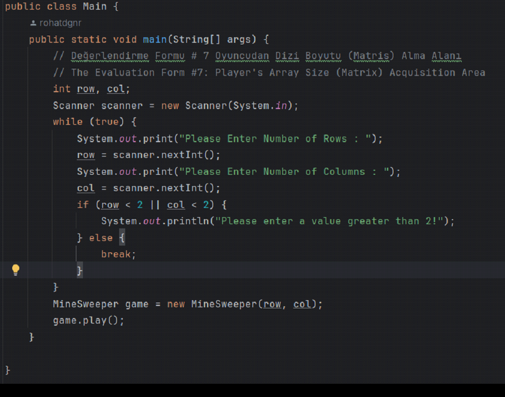
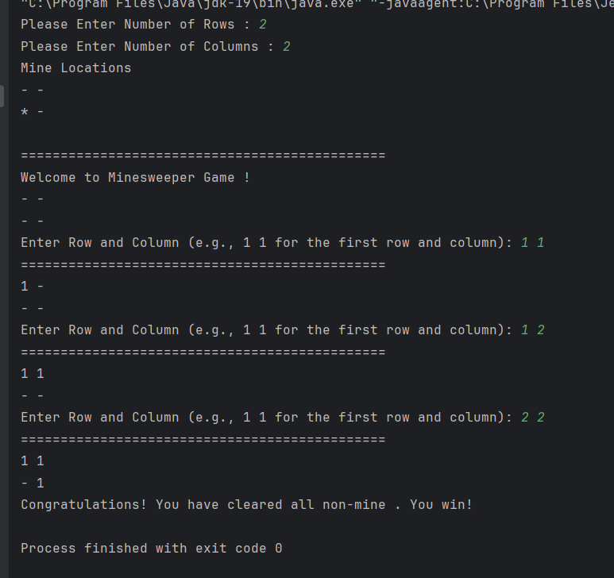
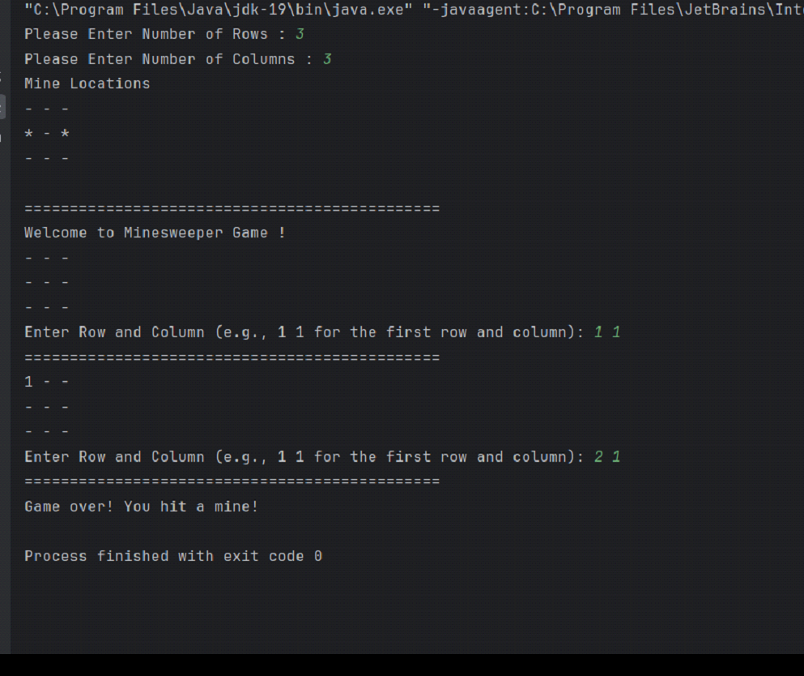

MineSweeper

Nasıl Oynanır

Oyunun başlangıcında, oyun tahtası "-" karakterleriyle gösterilir ve mayınlar rastgele yerleştirilir.
Oyuncu, satır ve sütun koordinatlarını girdiği sürece oyuna devam eder.
Girilen koordinatlara göre, oyun tahtası güncellenir ve eğer o alanda bir mayın yoksa, etrafındaki mayın sayısı yazdırılır.
Eğer oyuncu bir mayına rastlarsa, oyun sonlanır ve kaybeder.
Tüm mayın olmayan alanlar açıldığında, oyuncu kazanır.

Metod Açıklamaları

MineSweeper(int rows, int cols): Oyun tahtasını belirli bir satır ve sütun sayısıyla oluşturur. Mayınları yerleştirir.

firstBoard(): Oyun tahtasını "-" karakterleriyle doldurur.

placeMines(): Mayınları oyun tahtasına rastgele yerleştirir.

playBoard(): Oyun tahtasını ekrana yazdırır.

printMineLocations(): Mayınların rastgele yerleştirilmiş hâlini ekrana yazdırır.

play(): Oyunu başlatır ve oyun durumunu kontrol eder.

MineControl(int row, int col): Seçilen kareyi açar ve etrafındaki mayın sayısını kontrol eder.

nearbyMines(int row, int col): Girilen koordinatın çevresini kontrol eder ve temas edilen mayın sayısını hesaplar.

Kullanım Örneği

Aşağıdaki kod bloğu, kullanıcıdan satır ve sütun sayısını alarak Mayın Tarlası oyununu başlatır.

Bu kod bloğu, kullanıcının oyun için satır ve sütun sayısını belirlemesine olanak tanır ve ardından bu boyutlarda bir Mayın Tarlası oyunu başlatır.

Kullanıcının kazanma senaryasu. 

Bu ise kullanıcının kaybetme senaryosu.

Lisans

Bu proje MIT lisansı altında lisanslanmıştır. Detaylar için LİSANS dosyasına bakabilirsiniz.